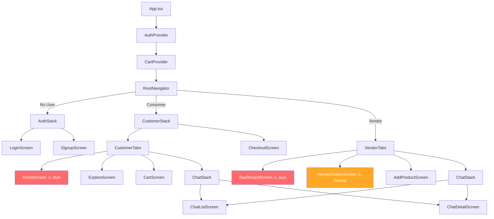

# Nimex Mobile App — Full Architecture Audit & Fix Plan

## Executive Summary

The Nimex mobile app is a **React Native / Expo SDK 54** marketplace app with multi-tenant architecture (Consumer/Vendor), Firebase backend, Flutterwave + Paystack payments, and real-time chat. After a thorough code review of all **28 source files**, I've identified **29+ issues** ranging from **app-crashing critical bugs** to missing functionality and architectural gaps.

---

## 🔴 CRITICAL BUGS (App will crash or fail to start)

### 1. Firebase Auth Import — Wrong Path (Crash on Launch)

> [!CAUTION]
> **File**: [firebase.ts](file:///c:/Users/DELL/Downloads/nimex-1-main/nimex-mobile/src/lib/firebase.ts#L2)
> 
> The import `firebase/auth/react-native` does **NOT exist** in Firebase JS SDK v12. This was an older SDK path from v9. The app will throw a `Module not found` error immediately.

```diff
- import { initializeAuth, getReactNativePersistence } from 'firebase/auth/react-native';
+ import { initializeAuth, getReactNativePersistence } from 'firebase/auth';
```

Also, `getReactNativePersistence` was moved to `firebase/auth` in SDK v12. The import path must be updated.

---

### 2. Firebase Auth — Double Initialization Crash

> [!CAUTION]
> **File**: [firebase.ts](file:///c:/Users/DELL/Downloads/nimex-1-main/nimex-mobile/src/lib/firebase.ts#L23-L34)
>
> When the app is already initialized (hot reload, fast refresh), calling `initializeAuth()` again on an existing app throws `auth/already-initialized`. The `else` branch calls `initializeAuth` on the existing app instead of using `getAuth()`.

```diff
  } else {
      app = getApp();
-     auth = initializeAuth(app, {
-         persistence: getReactNativePersistence(AsyncStorage)
-     });
+     // getAuth() returns the existing instance safely
+     auth = getAuth(app);
  }
```

---

### 3. Missing `SafeAreaProvider` Wrapper (UI clipping on notched devices)

> [!CAUTION]
> **File**: [App.tsx](file:///c:/Users/DELL/Downloads/nimex-1-main/nimex-mobile/App.tsx)
>
> The app uses `react-native-safe-area-context` (it's installed), but the root `<SafeAreaProvider>` wrapper is missing. Every `<SafeAreaView>` (e.g. in `PaymentWebView.tsx`) will crash or silently fail.

---

### 4. NativeWind v4 Misconfigured — className Props Won't Work

> [!CAUTION]
> **Files**: [babel.config.js](file:///c:/Users/DELL/Downloads/nimex-1-main/nimex-mobile/babel.config.js), missing `global.css`, missing `metro.config.js`
>
> The app has `nativewind@^4.2.3` installed with `tailwindcss@^3.3.2`, but:
> - Uses the **v2 babel plugin** `"nativewind/babel"` — NativeWind v4 does NOT use this plugin
> - Missing required `global.css` file with `@tailwind` directives
> - Missing `metro.config.js` with `withNativeWind()` wrapper
> - Missing `nativewind-env.d.ts` for TypeScript
>
> **Result**: Every `className` prop on every component is **silently ignored**. The entire app renders with zero styling.

**Fix**: Either downgrade to NativeWind v2 (simpler) or properly configure v4. Given the codebase uses v2 patterns, downgrading is recommended:
```
npm install nativewind@^2.0.11
```
Or fully configure v4 with the required setup files.

---

## 🟠 HIGH-SEVERITY BUGS

### 5. `PaymentWebView.tsx` — StyleSheet Typo

> [!WARNING]
> **File**: [PaymentWebView.tsx](file:///c:/Users/DELL/Downloads/nimex-1-main/nimex-mobile/src/components/PaymentWebView.tsx#L75)
>
> `fontBold: 'bold'` is not a valid React Native style property. Should be `fontWeight: 'bold'`.

```diff
- fontBold: 'bold',
+ fontWeight: 'bold',
```

---

### 6. Camera API — Deprecated `MediaTypeOptions`

> [!WARNING]
> **File**: [camera.ts](file:///c:/Users/DELL/Downloads/nimex-1-main/nimex-mobile/src/lib/camera.ts#L10)
>
> `ImagePicker.MediaTypeOptions` is deprecated in `expo-image-picker` v17. Use `mediaTypes: ['images']` instead.

```diff
- mediaTypes: ImagePicker.MediaTypeOptions.Images,
+ mediaTypes: ['images'],
```

---

### 7. `pickImageFromGallery()` — Missing Permission Request

> [!WARNING]
> **File**: [camera.ts](file:///c:/Users/DELL/Downloads/nimex-1-main/nimex-mobile/src/lib/camera.ts#L22-L34)
>
> `takePhoto` correctly requests camera permissions, but `pickImageFromGallery` **does not** request media library permissions. This will fail on iOS and newer Android versions.

---

### 8. Exports — Firebase Variables May Be `undefined`

> [!WARNING]
> **File**: [firebase.ts](file:///c:/Users/DELL/Downloads/nimex-1-main/nimex-mobile/src/lib/firebase.ts#L42)
>
> If the `try` block fails, `app`, `auth`, `db`, `storage`, `functions` are all exported as `undefined`. Every downstream consumer (`AuthContext`, `ChatListScreen`, `ExploreScreen`, etc.) will crash with `Cannot read property of undefined`.

---

### 9. `CartScreen` Navigation — Incorrect Route Target

> [!WARNING]
> **File**: [CartScreen.tsx](file:///c:/Users/DELL/Downloads/nimex-1-main/nimex-mobile/src/screens/customer/CartScreen.tsx#L76)
>
> `navigation.navigate('Checkout')` navigates to the `Checkout` screen which is in the `CustomerStack` (parent navigator). But `CartScreen` is inside `CustomerTabs` (child navigator). The navigation call **won't find the route** because React Navigation v7 doesn't automatically bubble up navigation commands to parent navigators.
>
> **Fix**: Use `navigation.getParent()?.navigate('Checkout')` or restructure the navigation.

---

### 10. `onPaymentSuccess` — Route Navigation After Payment

> [!WARNING]
> **File**: [CheckoutScreen.tsx](file:///c:/Users/DELL/Downloads/nimex-1-main/nimex-mobile/src/screens/customer/CheckoutScreen.tsx#L100)
>
> `navigation.navigate('Home')` tries to navigate to the `Home` screen which is inside `CustomerTabs`. But `CheckoutScreen` is in the parent `CustomerStack`. This navigation may or may not resolve correctly depending on navigator nesting.

---

## 🟡 MEDIUM ISSUES (Missing Functionality)

### 11. `HomeScreen` — Placeholder/Stub Screen

**File**: [HomeScreen.tsx](file:///c:/Users/DELL/Downloads/nimex-1-main/nimex-mobile/src/screens/customer/HomeScreen.tsx)

The customer home screen is nearly empty — just a welcome text, a "Location Features Demo" placeholder, and a sign-out button. **Missing**:
- Featured products carousel
- Category browsing
- Search bar
- Recent orders
- Promotional banners
- Location-based nearby products

---

### 12. `DashboardScreen` — Placeholder/Stub Screen

**File**: [DashboardScreen.tsx](file:///c:/Users/DELL/Downloads/nimex-1-main/nimex-mobile/src/screens/vendor/DashboardScreen.tsx)

The vendor dashboard is a stub. **Missing**:
- Revenue/sales metrics cards
- Recent orders list
- Product count
- Quick action buttons
- Analytics charts

---

### 13. `VendorOrdersScreen` — Uses Hardcoded Dummy Data

**File**: [VendorOrdersScreen.tsx](file:///c:/Users/DELL/Downloads/nimex-1-main/nimex-mobile/src/screens/vendor/VendorOrdersScreen.tsx#L4-L8)

Uses `dummyOrders` array instead of fetching from Firestore. **Missing**:
- Real-time order fetching from `orders` collection filtered by `vendor_id`
- Order status update functionality (mark as processing, shipped, delivered)
- Pull-to-refresh

---

### 14. Missing Product Detail Screen

**File**: [CustomerStack.tsx](file:///c:/Users/DELL/Downloads/nimex-1-main/nimex-mobile/src/navigation/CustomerStack.tsx#L21)

Comment says `{/* ProductDetailScreen will go here */}` — but it was never implemented. **Missing**:
- Product detail view with full description, images, vendor info
- Add-to-cart from detail screen
- Review/ratings display
- "Contact Vendor" button to init chat

---

### 15. No Image Upload to Firebase Storage

**File**: [AddProductScreen.tsx](file:///c:/Users/DELL/Downloads/nimex-1-main/nimex-mobile/src/screens/vendor/AddProductScreen.tsx#L53-L54)

Comment says "In production app, we would upload to Firebase Storage" — but the local `file://` URI is saved directly to Firestore. This URI is **only valid on the device that took the photo**. Other users will see broken images.

---

### 16. Delivery Fee Hardcoded

**File**: [CheckoutScreen.tsx](file:///c:/Users/DELL/Downloads/nimex-1-main/nimex-mobile/src/screens/customer/CheckoutScreen.tsx#L20)

`const deliveryCost = 2500;` — Hardcoded at ₦2,500 with no delivery address selection or distance-based calculation.

---

### 17. No Customer Order History Screen

Customers can place orders but have no screen to view their past orders, track delivery status, or reorder.

---

### 18. No User Profile / Settings Screen

Neither customer nor vendor has a profile editing screen for:
- Changing name, avatar
- Managing delivery addresses
- Payment method management
- Notification preferences

---

### 19. No Search Functionality

The `ExploreScreen` lists products but has no search bar, category filter, or price range filter.

---

### 20. Chat — No "Start New Chat" Flow

Users can view existing chats, but there's no way to initiate a new chat from a product page or vendor profile.

---

## 🟢 LOW-SEVERITY / POLISH ISSUES

### 21. Tab Bar — No Icons

Both `CustomerTabs` and `VendorTabs` have no `tabBarIcon` configured. The tab bar shows text-only labels with no icons — poor UX.

---

### 22. Price Formatting — Dollar Signs Instead of Naira

All prices show `$` prefix (e.g., `$4.99`) but the payment services use `NGN` currency and the delivery fee is `2500` (Naira). **Currency is inconsistent**.

---

### 23. `FlutterwaveService` — Unused `auth` Import

**File**: [flutterwaveService.ts](file:///c:/Users/DELL/Downloads/nimex-1-main/nimex-mobile/src/lib/flutterwaveService.ts#L1)

`import { auth } from './firebase'` is imported but never used.

---

### 24. `PaystackService` — Unused `auth` Import

**File**: [paystackService.ts](file:///c:/Users/DELL/Downloads/nimex-1-main/nimex-mobile/src/lib/paystackService.ts#L1)

Same issue — imported but never used.

---

### 25. No `.env.example` File

There's no `.env.example` file documenting required environment variables. New developers won't know what keys to set.

---

### 26. No Loading/Error States on Flutterwave Fallback

**File**: [flutterwaveService.ts](file:///c:/Users/DELL/Downloads/nimex-1-main/nimex-mobile/src/lib/flutterwaveService.ts#L56-L70)

When the backend returns a non-OK response, the service silently falls back to constructing a client-side Flutterwave URL. This bypasses server-side validation and is a **security concern** — amounts could be tampered with.

---

### 27. Order Items — Sequential Writes Instead of Batch

**File**: [orderService.ts](file:///c:/Users/DELL/Downloads/nimex-1-main/nimex-mobile/src/lib/orderService.ts#L43-L56)

Each order item is written with a separate `setDoc` call in a sequential loop. Should use `writeBatch()` for atomic, faster writes.

---

### 28. No `expo-splash-screen` Integration

The splash screen just shows the default Expo splash with no branding transition or controlled hide.

---

### 29. Missing `eas.json` for EAS Build

No `eas.json` configuration for building APK/AAB or IPA files.

---

## Architecture Overview



---

## Proposed Fix Plan (Priority Order)

### Phase 1 — Critical Fixes (Must-do before app can run)

| # | Fix | File(s) |
|---|-----|---------|
| 1 | Fix Firebase auth import path | `firebase.ts` |
| 2 | Fix double-init crash with `getAuth()` | `firebase.ts` |
| 3 | Fix NativeWind v4 → downgrade to v2 or properly configure v4 | `babel.config.js`, `package.json`, new config files |
| 4 | Add `SafeAreaProvider` wrapper | `App.tsx` |
| 5 | Add Firebase null-guard exports | `firebase.ts` |

### Phase 2 — High-Priority Bug Fixes

| # | Fix | File(s) |
|---|-----|---------|
| 6 | Fix PaymentWebView `fontBold` typo | `PaymentWebView.tsx` |
| 7 | Fix deprecated `MediaTypeOptions` | `camera.ts` |
| 8 | Add gallery permission request | `camera.ts` |
| 9 | Fix cart→checkout navigation | `CartScreen.tsx` |
| 10 | Fix post-payment navigation | `CheckoutScreen.tsx` |

### Phase 3 — Core Missing Features

| # | Feature | New/Modified Files |
|---|---------|-------------------|
| 11 | Build real HomeScreen with featured products, search, categories | `HomeScreen.tsx` |
| 12 | Build real DashboardScreen with metrics | `DashboardScreen.tsx` |
| 13 | Connect VendorOrders to Firestore | `VendorOrdersScreen.tsx` |
| 14 | Create ProductDetailScreen | New `ProductDetailScreen.tsx`, update navigation |
| 15 | Implement Firebase Storage image upload | `AddProductScreen.tsx` |
| 16 | Add tab bar icons (Expo vector icons) | `CustomerTabs.tsx`, `VendorTabs.tsx` |
| 17 | Fix currency to Naira (₦) throughout | All screens with prices |
| 18 | Create CustomerOrdersScreen | New screen + navigation |
| 19 | Create ProfileScreen | New screen + navigation |
| 20 | Add search to ExploreScreen | `ExploreScreen.tsx` |

### Phase 4 — Polish & Production Readiness

| # | Task | File(s) |
|---|------|---------|
| 21 | Use `writeBatch()` in orderService | `orderService.ts` |
| 22 | Remove unused imports | `flutterwaveService.ts`, `paystackService.ts` |
| 23 | Create `.env.example` | New file |
| 24 | Add `eas.json` for EAS builds | New file |
| 25 | Remove Flutterwave client-side fallback | `flutterwaveService.ts` |
| 26 | Integrate splash screen | `App.tsx`, `app.json` |

---

## Verification Plan

### Automated Tests
- Run `npx expo start` and verify no crash on launch
- Run `npx tsc --noEmit` for TypeScript type checking
- Test auth flow: sign up → sign in → profile fetch → sign out
- Test cart flow: add → update quantity → remove → checkout
- Test vendor flow: camera → form → create product

### Manual Verification
- Verify NativeWind styling renders correctly on a device/simulator
- Test payment WebView redirect detection
- Verify Firestore read/write operations for products, orders, chats
- Test on both iOS and Android (notch handling with SafeAreaProvider)

---

## Open Questions

> [!IMPORTANT]
> 1. **NativeWind version**: Should we downgrade to NativeWind v2 (simpler, matching current code patterns) or properly configure v4 (more future-proof but requires significant config changes)?
>
> 2. **Currency**: The web app appears to use Nigerian Naira (₦), but the mobile app displays `$`. Should all prices use `₦` formatting?
>
> 3. **Scope**: Should I implement **all phases** (full fix + missing features), or start with **Phase 1-2 only** (critical fixes) and iterate?
>
> 4. **Firebase project**: Is the Firebase project already configured with the required collections (`products`, `orders`, `order_items`, `chatRooms`, `profiles`)? Do you have the `.env` values ready?
